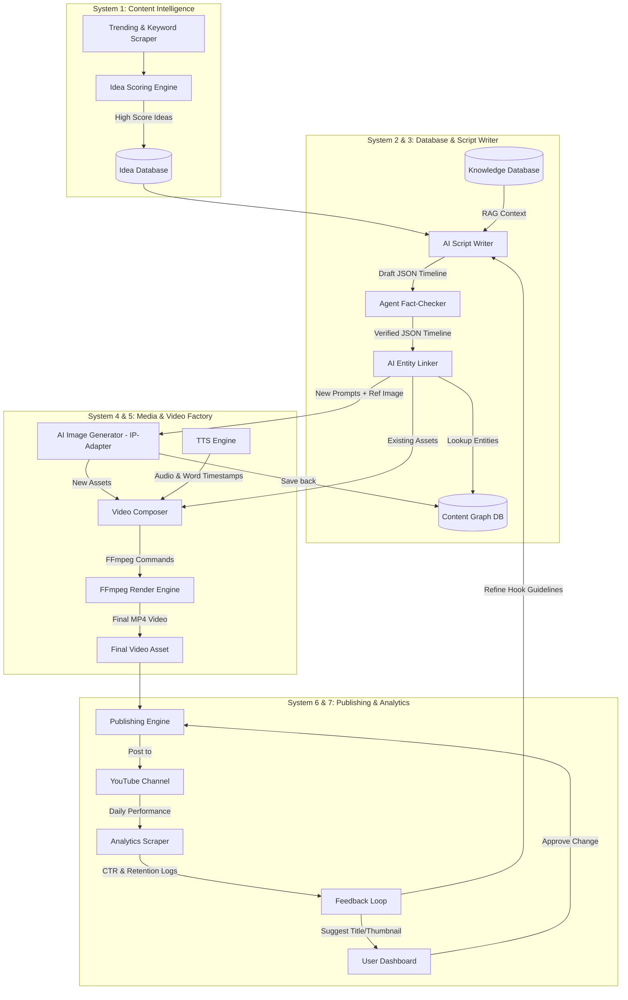

# BẢN PHÂN TÍCH VÀ PHẢN BIỆN THIẾT KẾ: AI CONTENT FACTORY

Tài liệu này tổng hợp kết quả của phiên phản biện `/grill-me` đối với tài liệu thiết kế hệ thống sản xuất nội dung tự động của bạn. Chúng ta đã thống nhất các quyết định kiến trúc quan trọng nhằm tối ưu hóa chi phí, đảm bảo chất lượng và xây dựng hệ thống bền vững.

---

## 1. Các Quyết Định Kiến Trúc Then Chốt (Finalized Decisions)

Sau khi thảo luận qua các nhánh thiết kế, dưới đây là mô hình hoạt động chi tiết đã được tối ưu hóa:

### 🎬 System 5: Video Factory (Hạ tầng dựng video)
*   **Công nghệ Render:** Sử dụng **FFmpeg** phối hợp với script điều phối **Python (MoviePy)**. Loại bỏ Remotion cho video dài để tránh quá tải tài nguyên hệ thống.
*   **Hiệu ứng & Chuyển cảnh:** Hướng tới video dài từ 5-15 phút, tập trung vào kiến thức chuyên sâu. Sử dụng hiệu ứng **Ken Burns (Zoompan)** trên hình ảnh tĩnh, chuyển cảnh nhẹ nhàng (fade-in/out) và phụ đề kiểu `.ass` (Advanced SubStation Alpha) để render nhanh, ổn định.
*   **Cơ chế khớp nối (Alignment):**
    ```mermaid
    flowchart LR
        A[AI Script Writer] -->|JSON Timeline| B[TTS Engine]
        B -->|Audio + Timestamps| C[Video Composer]
        C -->|Match Images/Footage| D[FFmpeg Render]
    ```
    AI sinh kịch bản dưới dạng JSON timeline (chứa văn bản, prompt sinh ảnh và từ khóa B-roll). Audio sinh ra từ TTS có chứa **Word/Sentence Timestamps** để map ngược lại thời lượng hiển thị hình ảnh tự động.

### 🗂️ System 2: Content Database & Content Graph
*   **Cơ chế tái sử dụng:** **AI Entity Linker**. Khi viết kịch bản, AI tự động trích xuất các thực thể cốt lõi (ví dụ: Napoleon, Mèo Cam...). Hệ thống tra cứu Vector DB/Graph DB để tái sử dụng hình ảnh/video/prompt cũ của thực thể đó nhằm tiết kiệm chi phí và tăng tốc độ xử lý.
*   **Nhất quán hình ảnh (Visual Consistency):** Sử dụng **Style Preset** kết hợp **Image-to-Image / Reference Image**. Mỗi dự án video cấu hình một phong cách cố định (ví dụ: *cinematic painting*). Khi vẽ ảnh mới cho thực thể, ảnh cũ được truyền làm Reference (qua IP-Adapter/ControlNet) để đồng bộ nét mặt và phong cách mỹ thuật.

### ✍️ System 3: AI Script Writer (Biên tập & Fact Check)
*   **Cơ chế Fact Check:** **Agent Phản Biện (Two-stage RAG + Cross-Check)**.
    1.  **Bước 1:** Thu thập dữ liệu từ các nguồn uy tín (Google Search, Wikipedia) lưu vào Database.
    2.  **Bước 2:** AI viết kịch bản chỉ sử dụng thông tin trong DB đã lọc.
    3.  **Bước 3:** Một Agent Fact-checker độc lập quét kịch bản, trích xuất số liệu/mốc thời gian quan trọng (claims) và đối chiếu với web search bên ngoài để xác minh trước khi duyệt.

### 📊 System 7: Analytics (Vòng lặp tự học)
*   **Cơ chế tối ưu hóa:** **Human-approved A/B Testing**. Hệ thống tự động lấy dữ liệu từ YouTube Analytics API sau 48h. Nếu CTR thấp, AI tự sinh 3 bộ Tiêu đề & Thumbnail mới và đề xuất trên Dashboard. Người dùng duyệt mới đổi qua API. 
*   **Vòng phản hồi:** AI Script Writer sẽ đọc dữ liệu Retention thấp của video trước để tự động điều chỉnh cấu trúc/độ dài của Hook trong các kịch bản tiếp theo.

---

## 2. Kiến Trúc Hệ Thống Tổng Thể (System Architecture)

Dưới đây là sơ đồ luồng hoạt động hoàn chỉnh của **AI Content Factory**:



---

## 3. Khuyến Nghị Công Nghệ Lựa Chọn (Tech Stack Recommendation)

Để chuẩn bị triển khai Giai đoạn 1 của Roadmap, đây là những công nghệ bạn nên chọn:

| Hệ thống | Thành phần khuyến nghị | Vai trò |
| :--- | :--- | :--- |
| **Database** | PostgreSQL + `pgvector` + Neo4j / RDS Graph | Lưu trữ tri thức thực thể, vector embeddings của ảnh và mối quan hệ graph |
| **AI Agents** | LangGraph / CrewAI | Thiết kế luồng Agent biên tập và Agent Fact-check phản biện |
| **TTS Engine** | ElevenLabs API hoặc OpenAI TTS | Sinh giọng đọc chất lượng cao hỗ trợ xuất timestamps theo từ |
| **Media Gen** | Replicate API (Flux-dev / SDXL + IP-Adapter) | Sinh ảnh đồng bộ phong cách và khuôn mặt nhân vật |
| **Video Factory** | Python + FFmpeg (định dạng phụ đề `.ass`) | Ghép nối tự động, áp dụng hiệu ứng Ken Burns và render video tốc độ cao |

---

> [!TIP]
> **Chiến lược Giai đoạn 1 (Tháng 1-2):**
> Nên tập trung xây dựng hoàn chỉnh **Core Pipeline** thủ công một phần trước: **Ý tưởng -> Kịch bản (Fact check bằng cơm) -> Sinh Voice (ElevenLabs) -> Xuất JSON Timeline -> Chạy script Python/FFmpeg để render video**. Khi luồng cơ bản này chạy mượt mà, bạn mới tiến hành tự động hóa khâu Content Graph và Agent Fact-checker để tránh bị ngộp.
